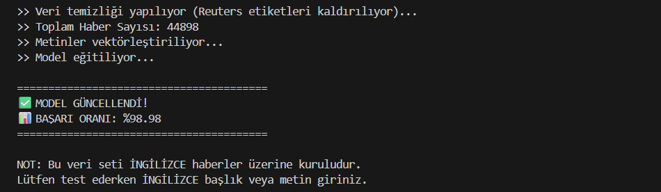
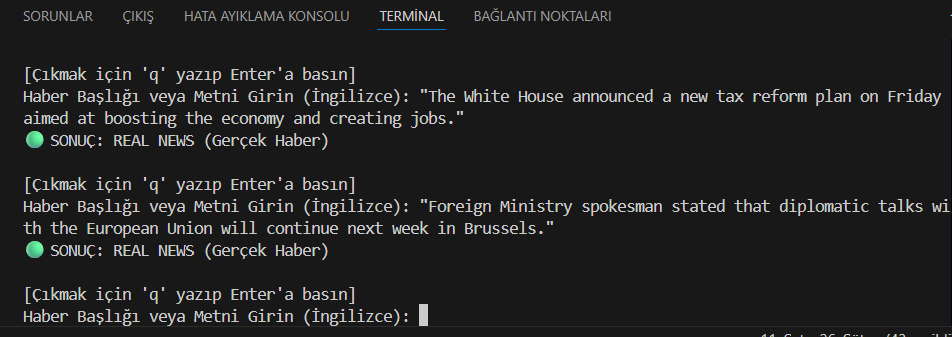
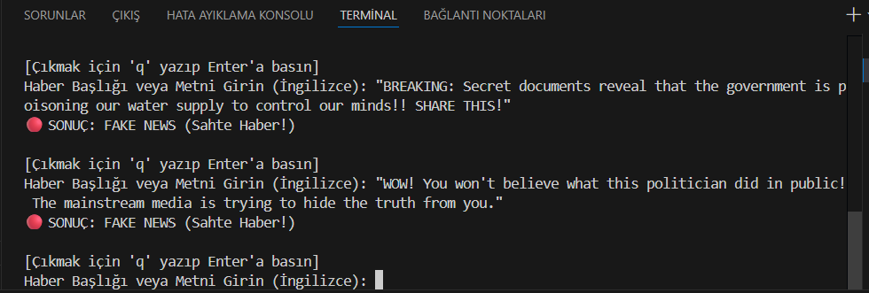
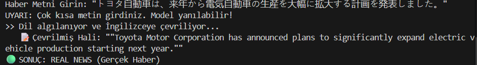
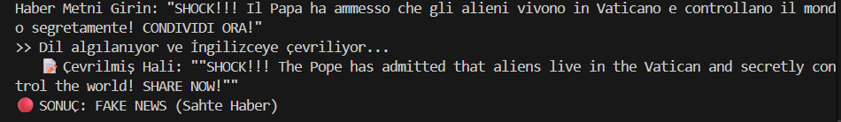

# 🕵️‍♂️ Fake News Detection System (Sahte Haber Tespit Sistemi)

Bu proje, Makine Öğrenmesi (Machine Learning) ve Doğal Dil İşleme (NLP) teknikleri kullanılarak haber metinlerinin gerçek mi yoksa sahte mi olduğunu tespit eden bir yapay zeka uygulamasıdır.

## 🚀 Proje Hakkında
Günümüzde bilgi kirliliği ve dezenformasyonun artmasıyla birlikte, haberlerin doğruluğunu teyit etmek zorlaşmıştır. Bu proje, **Passive Aggressive Classifier** algoritmasını kullanarak haber metinleri üzerinde **%90 üzeri doğruluk oranıyla** sınıflandırma yapar.

### 🛠️ Kullanılan Teknolojiler
* **Python 3.x**
* **Scikit-learn:** Makine öğrenmesi modeli ve vektörleştirme (TF-IDF) için.
* **Pandas & Numpy:** Veri manipülasyonu ve analizi için.

## 📂 Veri Seti
Proje, Kaggle üzerinden sağlanan açık kaynaklı "Fake and Real News Dataset" kullanılarak eğitilmiştir. Veri seti, binlerce politik ve güncel haber metnini içerir.

## 📸 Ekran Görüntüleri ve Test Sonuçları

### 1. Model Başarı Oranı
Model eğitildikten sonra elde edilen doğruluk skoru:


### 2. Gerçek Haber Testi (Real News)
BBC kaynağından alınan veri ile yapılan test sonucu:


### 3. Sahte Haber Testi (Fake News)
Manipülatif içerik ile yapılan test sonucu:

---
## 🌍 v2.0 Güncellemesi: Çoklu Dil Desteği (Multi-language Support)

Projenin 2. versiyonunda **Google Translate API** entegrasyonu yapılmıştır. Artık sistem, girilen metnin dilini otomatik olarak algılar, İngilizceye çevirir ve analiz eder.

### Test 1: Japonca Haber Testi (Non-Latin Characters)
Latin alfabesi dışındaki dillerde bile sistemin çalıştığının kanıtı:


### Test 2: İtalyanca Sahte Haber Testi (Logic Check)
Çeviri katmanına rağmen modelin "Fake" içeriği başarıyla tespit etmesi:


## ⚠️ Sınırlamalar ve Bilinen Sorunlar (Limitations)

1. **Çeviri Hassasiyeti:** Sistem, İngilizce olmayan metinler için Google Translate altyapısını kullandığından, nadiren de olsa çeviri hataları tahmin doğruluğunu etkileyebilir.
2. **Yanlış Alarmlar (False Positives):** Tık tuzağı (clickbait) haberlerde sıkça geçen iddialı kelimeler (Örn: "Acil", "Şok", "İnanılmaz"), haberin kaynağı güvenilir olsa bile modelin "Sahte" olarak etiketlemesine neden olabilir.

## 💻 Kurulum ve Çalıştırma

1. Projeyi bilgisayarınıza klonlayın veya indirin.
2. Gerekli kütüphaneleri yükleyin:
   ```bash

   pip install -r requirements.txt

