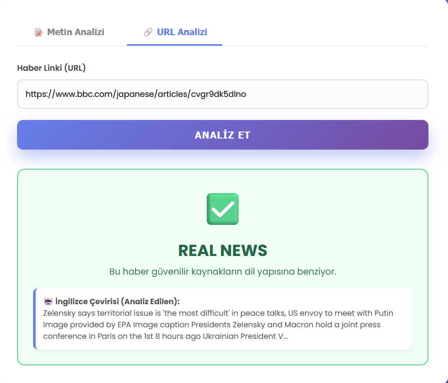
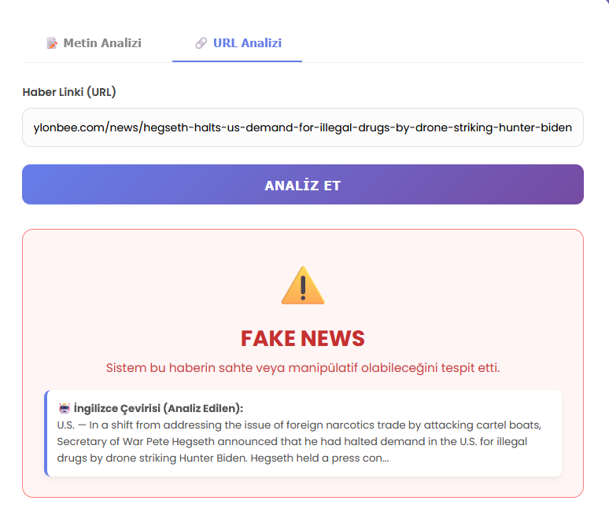
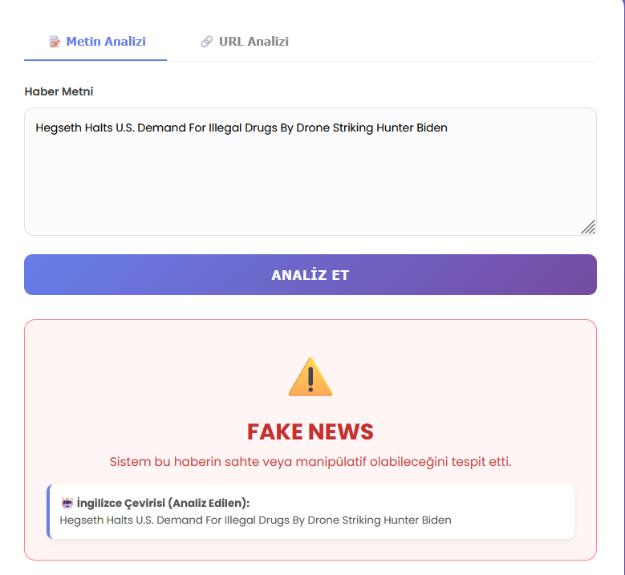

# 🕵️‍♂️ Fake News Detection System (Sahte Haber Tespit Sistemi)

Bu proje, Makine Öğrenmesi (Machine Learning) ve Doğal Dil İşleme (NLP) teknikleri kullanılarak haber metinlerinin gerçek mi yoksa sahte mi olduğunu tespit eden bir yapay zeka uygulamasıdır.

## 🚀 Proje Hakkında
Günümüzde bilgi kirliliği ve dezenformasyonun artmasıyla birlikte, haberlerin doğruluğunu teyit etmek zorlaşmıştır. Bu proje, **Passive Aggressive Classifier** algoritmasını kullanarak haber metinleri üzerinde **%90 üzeri doğruluk oranıyla** sınıflandırma yapar.

### 🛠️ Kullanılan Teknolojiler
* **Python 3.x**
* **Scikit-learn:** Makine öğrenmesi modeli ve vektörleştirme (TF-IDF) için.
* **Pandas & Numpy:** Veri manipülasyonu ve analizi için.

## 📂 Veri Seti
Proje, Kaggle üzerinden sağlanan açık kaynaklı "Fake and Real News Dataset" kullanılarak eğitilmiştir. Veri seti, binlerce politik ve güncel haber metnini içerir.

## 📸 Ekran Görüntüleri ve Test Sonuçları

### 1. Model Başarı Oranı
Model eğitildikten sonra elde edilen doğruluk skoru:


### 2. Gerçek Haber Testi (Real News)
BBC kaynağından alınan veri ile yapılan test sonucu:


### 3. Sahte Haber Testi (Fake News)
Manipülatif içerik ile yapılan test sonucu:

---
## 🌍 v2.0 Güncellemesi: Çoklu Dil Desteği (Multi-language Support)

Projenin 2. versiyonunda **Google Translate API** entegrasyonu yapılmıştır. Artık sistem, girilen metnin dilini otomatik olarak algılar, İngilizceye çevirir ve analiz eder.

### Test 1: Japonca Haber Testi (Non-Latin Characters)
Latin alfabesi dışındaki dillerde bile sistemin çalıştığının kanıtı:


### Test 2: İtalyanca Sahte Haber Testi (Logic Check)
Çeviri katmanına rağmen modelin "Fake" içeriği başarıyla tespit etmesi:


---

## 🌐 v3.0 Güncellemesi: Web Arayüzü & Canlı URL Analizi (Web UI)

Proje, v3 sürümüyle birlikte komut satırı (CLI) uygulamasından çıkarak **Flask** tabanlı modern bir web arayüzüne kavuşmuştur.

### 🚀 v3.0 Yenilikleri
* **Ayrıştırılmış Mimari:** Eğitim (`train.py`) ve Test (`app.py`) süreçleri performans için ayrıldı. Model artık bir kez eğitilip `.pkl` formatında kaydediliyor (Sıfır bekleme süresi).
* **URL Destekli Analiz:** Kullanıcılar haber linkini yapıştırarak, `Newspaper3k` kütüphanesi sayesinde otomatik içerik çekimi ve analizi yapabilir.
* **Anti-Bloklama:** Haber sitelerinin bot korumasını aşmak için *User-Agent* (Chrome) simülasyonu eklendi.

### 📸 v3 Arayüz Test Sonuçları

#### 1. Gerçek Haber Testi: Japonca (Real News Detection)
Sistemin Latin alfabesi dışındaki dillerde (URL ve Metin girişi ile) çalışma performansı.
*Sol: URL Analizi (BBC Japan) | Sağ: Metin Analizi (BBC Japan)*

<p float="left">
  
   
</p>

#### 2. Sahte Haber Testi: BabylonBee (Fake News Detection)
Sistemin parodi ve manipülatif içerikleri tespit etme performansı.
*Sol: URL Analizi (BabylonBee) | Sağ: Metin Analizi (BabylonBee)*

<p float="left">
  
  
</p>

### 💻 v3 Nasıl Çalıştırılır?

Mimari değişikliği sebebiyle çalıştırma adımları güncellenmiştir:

1.  **Modeli Eğit (Sadece kurulumda 1 kez):**
    ```bash
    python train.py
    ```
    *Bu işlem `fake_news_model.pkl` dosyasını oluşturur.*

2.  **Web Arayüzünü Başlat:**
    ```bash
    python app.py
    ```
    *Terminalde çıkan `http://127.0.0.1:5000` linkine tıklayın.*

## ⚠️ Sınırlamalar ve Bilinen Sorunlar (Limitations)

1. **Çeviri Hassasiyeti:** Sistem, İngilizce olmayan metinler için Google Translate altyapısını kullandığından, nadiren de olsa çeviri hataları tahmin doğruluğunu etkileyebilir.
2. **Yanlış Alarmlar (False Positives):** Tık tuzağı (clickbait) haberlerde sıkça geçen iddialı kelimeler (Örn: "Acil", "Şok", "İnanılmaz"), haberin kaynağı güvenilir olsa bile modelin "Sahte" olarak etiketlemesine neden olabilir.

## 💻 Kurulum ve Çalıştırma

1. Projeyi bilgisayarınıza klonlayın veya indirin.
2. Gerekli kütüphaneleri yükleyin:
   ```bash

   pip install -r requirements.txt


